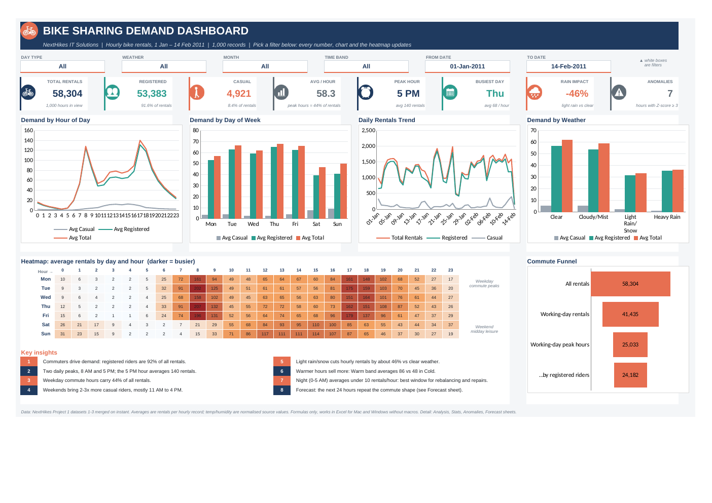

# Bike Sharing Demand Analysis (Excel)

**NextHikes IT Solutions · Data Analysis with Excel**
Author: Amita Yadav

This project analyses how time of day, weekday, weather and holidays affect hourly bike rentals. Three raw datasets were cleaned, merged and appended in Excel, analysed with Excel functions, and presented in an interactive one-screen dashboard, with anomaly detection, a 48-hour forecast and VBA automation.

## Key findings

- **Commuters drive demand.** Registered riders made 53,383 of the 58,304 rentals (91.6%).
- **Two daily peaks:** 5 PM (about 140 rentals per hour) and 8 AM (about 128). Night hours average under 10.
- **Weekday commute hours** (7 to 9 AM, 4 to 7 PM) carry 43% of all rentals.
- **Weekends:** fewer rentals overall (48.1 vs 63.3 per hour), but casual riders more than double.
- **Rain** cuts hourly rentals by about 46% compared with clear weather.
- **7 of 1,000 hours** were flagged as anomalies (z-score of 3 or more for their hour of day). They were kept as real busy hours.
- **Forecast:** FORECAST.ETS with 24-hour seasonality; MAE 21 rentals per hour, MASE 0.98.

## Repository contents

| File | What it is |
| --- | --- |
| `nexthikes_project_excel.xlsx` | Main workbook: cleaning stages, analysis, statistics, anomalies, forecast and dashboard (15 sheets, cell comments throughout) |
| `Bike_Sharing_Analysis.xlsm` | The same workbook with the VBA module imported (automated report) |
| `BikeSharingAutomation.bas` | VBA module source code |
| `Summary_Report.pdf` | Summary document (9 pages) |
| `Bike_Sharing_Demand_Analysis.pptx` | Presentation (16 slides) |
| `data/` | Original datasets 1, 2 and 3 |
| `dashboard.png` | Dashboard screenshot |
| `LICENSE` | MIT licence |

## Method

1. **Pre-processing** of each dataset: data types, blanks and duplicates checked. In Dataset 2 the leftover index column was removed and 11 blank feels-like temperatures were filled with the average of the neighbouring hours. Dataset 3 was sorted by `instant`.
2. **Merge:** Dataset 1 + Dataset 2 on `instant` (INDEX/MATCH, equivalent to a Left Outer merge), giving Dataset A (610 × 16).
3. **Append:** Dataset 3 under Dataset A, giving the final dataset (1,000 × 16) plus 15 engineered columns (day type, weather label, time band, temperature band, peak flag, casual share, demand level and more).
4. **Analysis:** text functions (LEFT, RIGHT, LEN, TEXT), lookups (VLOOKUP, INDEX/MATCH), IF logic, COUNTIF/SUMIF/AVERAGEIFS, descriptive statistics, a correlation matrix and pivot-style summaries with charts.
5. **Dashboard:** KPI cards with icons, drop-down filters and a date range, hourly, weekday, daily and weather charts, an hour × weekday heatmap and a commute funnel.
6. **Anomaly detection:** z-score for each hour against the mean and standard deviation of the same hour of day.
7. **Forecast:** FORECAST.ETS with 24-hour seasonality for the next 48 hours, with a 95% confidence band.
8. **Automation:** a VBA macro builds an "Automated Report" sheet, exports it to PDF, resets filters and logs each run.

## How to use

Open `nexthikes_project_excel.xlsx` (or the `.xlsm` file, choosing **Enable Macros**). Start on the **Cover** sheet, then the **Dashboard**. Hover over cells with a red triangle to read the comments.

## Tools

Microsoft Excel (formulas, conditional formatting, data validation, charts, FORECAST.ETS) and VBA.

## Licence

MIT, see [LICENSE](LICENSE).
